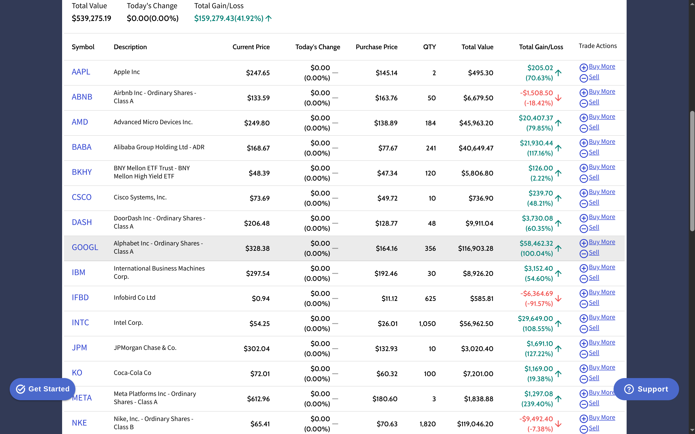
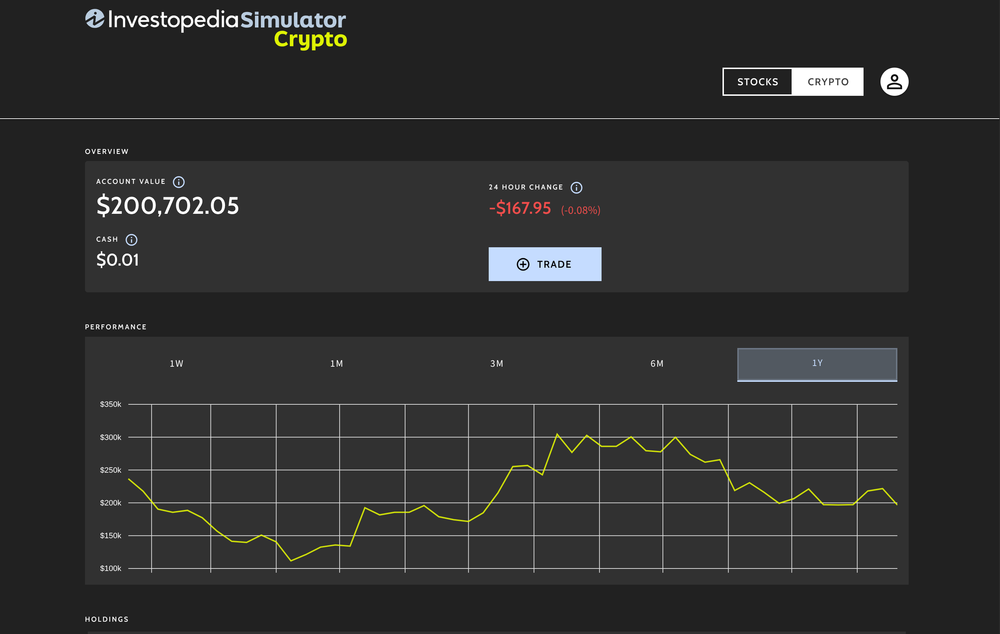
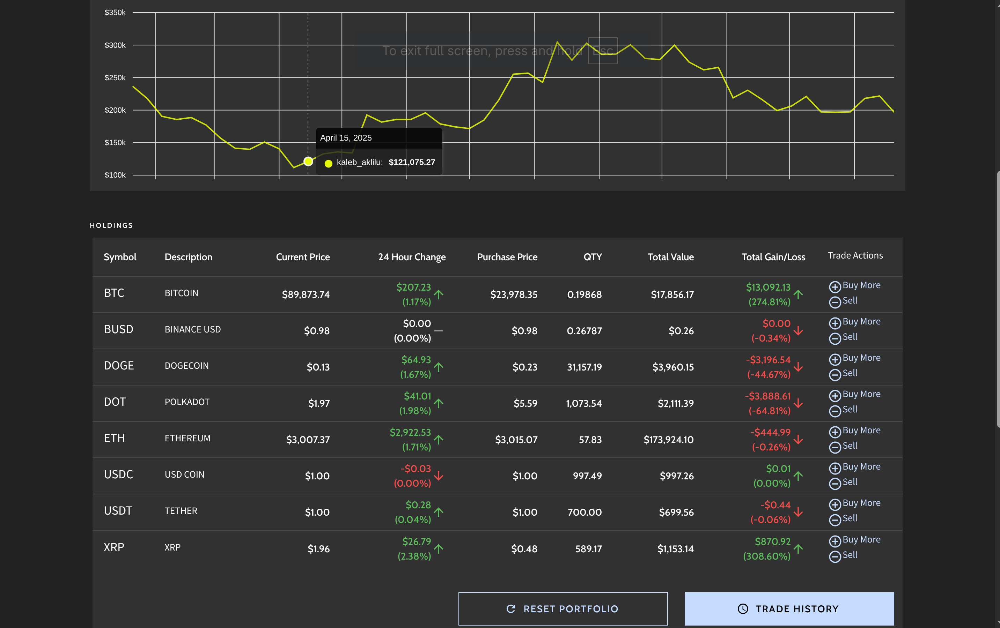

# Investment Portfolio Analysis

An automated analysis of investment performance, tracking both cryptocurrency and stock market assets.

## Overview

This repository contains performance data and visualizations for a quantitative investment portfolio.

## Visualizations

### Stock Market Performance

Analysis of stock holdings and company-specific performance metrics.

|        Stock Market Overview        |                Company Analysis                |
| :---------------------------------: | :--------------------------------------------: |
|  |  |

---

### Cryptocurrency Performance

Overview of crypto asset performance and individual coin analysis.

|        Crypto Market Overview         |              Coin Analysis               |
| :-----------------------------------: | :--------------------------------------: |
|  |  |

### Historical Stock Performance

| Date | Stock Value |
| :--- | :---------- |
| 1/21/2026 | $519,474.60 |
| 1/20/2026 | $526,860.87 |
| 1/17/2026 | $526,823.22 |
| 1/16/2026 | $530,557.64 |
| 1/15/2026 | $531,768.47 |
| 1/14/2026 | $531,410.83 |
| 1/13/2026 | $521,910.70 |
| 1/10/2026 | $518,249.64 |
| 1/09/2026 | $512,293.90 |
| 1/08/2026 | $508,898.34 |
| 1/07/2026 | $509,051.05 |
| 1/06/2026 | $511,086.80 |
| 1/03/2026 | $507,818.44 |
| 1/02/2026 | $500,356.03 |
| 1/01/2026 | $500,373.78 |
| 12/31/2025 | $497,918.35 |
| 12/30/2025 | $498,061.38 |
| 12/27/2025 | $498,795.90 |
| 12/26/2025 | $495,719.93 |
| 12/25/2025 | $495,719.93 |
| 12/24/2025 | $491,678.75 |
| 12/23/2025 | $487,146.13 |
| 12/20/2025 | $487,112.93 |
| 12/19/2025 | $491,014.73 |
| 12/18/2025 | $486,554.45 |
| 12/17/2025 | $499,340.24 |
| 12/16/2025 | $501,435.76 |
| 12/13/2025 | $502,873.85 |
| 12/12/2025 | $511,094.06 |
| 12/11/2025 | $513,229.28 |
| 12/10/2025 | $507,077.44 |
| 12/09/2025 | $506,080.73 |
| 12/06/2025 | $512,396.38 |
| 12/05/2025 | $509,625.54 |
| 12/04/2025 | $512,177.01 |
| 12/03/2025 | $509,317.49 |
| 12/02/2025 | $507,165.00 |
| 11/29/2025 | $504,594.20 |
| 11/28/2025 | $500,315.02 |
| 11/27/2025 | $500,283.77 |
| 11/26/2025 | $496,558.89 |
| 11/25/2025 | $495,785.60 |
| 11/22/2025 | $483,797.89 |
| 11/21/2025 | $477,262.25 |
| 11/20/2025 | $490,546.13 |
| 11/19/2025 | $486,376.18 |
| 11/18/2025 | $491,639.21 |
| 11/15/2025 | $494,407.56 |
| 11/14/2025 | $498,430.62 |
| 11/13/2025 | $505,291.59 |
| 11/12/2025 | $502,007.87 |
| 11/11/2025 | $502,491.11 |
| 11/08/2025 | $491,531.08 |
| 11/07/2025 | $494,203.18 |
| 11/06/2025 | $503,414.33 |
| 11/05/2025 | $498,308.25 |
| 11/04/2025 | $512,455.51 |
| 11/01/2025 | $514,466.82 |
| 10/31/2025 | $516,342.43 |
| 10/30/2025 | $522,060.87 |
| 10/29/2025 | $518,775.75 |
| 10/28/2025 | $516,298.53 |
| 10/25/2025 | $507,040.70 |
| 10/24/2025 | $498,802.42 |
| 10/23/2025 | $492,480.18 |
| 10/22/2025 | $494,041.95 |
| 10/21/2025 | $497,481.86 |
| 10/18/2025 | $491,564.12 |
| 10/17/2025 | $488,307.71 |
| 10/16/2025 | $413,715.40 |
| 10/15/2025 | $404,904.38 |
| 10/14/2025 | $410,272.72 |
| 10/11/2025 | $399,853.66 |
| 10/10/2025 | $417,760.67 |
| 10/09/2025 | $420,406.52 |
| 10/08/2025 | $414,245.62 |
| 10/07/2025 | $417,078.37 |
| 10/04/2025 | $409,288.45 |
| 10/03/2025 | $413,014.47 |
| 10/02/2025 | $407,793.27 |
| 10/01/2025 | $400,178.69 |
| 9/30/2025 | $399,833.95 |
| 9/27/2025 | $398,003.27 |
| 9/26/2025 | $396,587.17 |
| 9/25/2025 | $394,818.26 |
| 9/24/2025 | $392,088.37 |
| 9/23/2025 | $393,862.27 |
| 9/20/2025 | $391,536.86 |
| 9/19/2025 | $392,445.23 |
| 9/18/2025 | $383,709.70 |
| 9/17/2025 | $386,206.42 |
| 9/16/2025 | $385,572.53 |
| 9/13/2025 | $379,807.37 |
| 9/12/2025 | $380,681.83 |
| 9/11/2025 | $378,270.75 |
| 9/10/2025 | $374,498.80 |
| 9/09/2025 | $368,805.27 |
| 9/06/2025 | $366,469.81 |
| 9/05/2025 | $370,438.15 |
| 9/04/2025 | $369,435.21 |
| 9/03/2025 | $363,476.58 |
| 9/02/2025 | $367,292.15 |
| 8/30/2025 | $367,292.15 |
| 8/29/2025 | $367,954.77 |
| 8/28/2025 | $367,242.41 |
| 8/27/2025 | $367,143.19 |
| 8/26/2025 | $366,518.47 |
| 8/23/2025 | $365,420.16 |
| 8/22/2025 | $356,085.69 |
| 8/21/2025 | $356,709.22 |
| 8/20/2025 | $360,225.80 |
| 8/19/2025 | $364,573.01 |
| 8/16/2025 | $364,593.98 |
| 8/15/2025 | $364,794.79 |
| 8/14/2025 | $365,378.46 |
| 8/13/2025 | $361,755.09 |
| 8/12/2025 | $356,436.29 |
| 8/09/2025 | $357,391.36 |
| 8/08/2025 | $355,164.49 |
| 8/07/2025 | $354,139.59 |
| 8/06/2025 | $353,068.62 |
| 8/05/2025 | $354,462.66 |
| 8/02/2025 | $347,663.27 |
| 8/01/2025 | $353,744.83 |
| 7/31/2025 | $357,981.96 |
| 7/30/2025 | $357,492.01 |
| 7/29/2025 | $357,927.37 |
| 7/26/2025 | $352,803.80 |
| 7/25/2025 | $353,297.53 |
| 7/24/2025 | $353,045.21 |
| 7/23/2025 | $348,722.88 |
| 7/22/2025 | $349,651.53 |
| 7/19/2025 | $347,017.22 |
| 7/18/2025 | $347,213.72 |
| 7/17/2025 | $344,860.89 |
| 7/16/2025 | $344,139.74 |
| 7/15/2025 | $338,415.28 |
| 7/12/2025 | $338,400.69 |
| 7/11/2025 | $338,470.54 |
| 7/10/2025 | $334,892.29 |
| 7/09/2025 | $359,795.57 |
| 7/08/2025 | $358,690.95 |
| 7/05/2025 | $364,871.05 |
| 7/04/2025 | $364,871.05 |
| 7/03/2025 | $362,925.94 |
| 7/02/2025 | $357,117.37 |
| 7/01/2025 | $360,210.14 |
| 6/28/2025 | $363,038.84 |
| 6/27/2025 | $353,619.31 |
| 6/26/2025 | $350,255.84 |
| 6/25/2025 | $349,902.23 |
| 6/24/2025 | $346,260.25 |
| 6/21/2025 | $341,049.78 |
| 6/20/2025 | $344,393.56 |
| 6/19/2025 | $344,393.56 |
| 6/18/2025 | $343,803.34 |
| 6/17/2025 | $348,151.66 |
| 6/14/2025 | $342,710.82 |
| 6/13/2025 | $346,475.08 |
| 6/12/2025 | $348,254.71 |
| 6/11/2025 | $350,916.84 |
| 6/10/2025 | $342,752.75 |
| 6/07/2025 | $310,157.54 |
| 6/06/2025 | $304,650.45 |
| 6/05/2025 | $314,025.11 |
| 6/04/2025 | $313,901.71 |
| 6/03/2025 | $311,671.30 |
| 5/31/2025 | $311,049.70 |
| 5/30/2025 | $316,441.16 |
| 5/29/2025 | $314,417.80 |
| 5/28/2025 | $317,499.85 |
| 5/27/2025 | $308,542.54 |
| 5/24/2025 | $308,542.54 |
| 5/23/2025 | $311,160.33 |
| 5/22/2025 | $309,603.27 |
| 5/21/2025 | $313,147.22 |
| 5/20/2025 | $314,245.62 |
| 5/17/2025 | $316,403.08 |
| 5/16/2025 | $313,697.50 |
| 5/15/2025 | $317,059.35 |
| 5/14/2025 | $311,210.51 |
| 5/13/2025 | $304,140.59 |
| 5/10/2025 | $290,809.33 |
| 5/09/2025 | $288,921.72 |
| 5/08/2025 | $284,131.85 |
| 5/07/2025 | $287,277.46 |
| 5/06/2025 | $289,418.43 |
| 5/03/2025 | $291,818.18 |
| 5/02/2025 | $285,037.49 |
| 5/01/2025 | $282,762.66 |
| 4/30/2025 | $286,077.95 |
| 4/29/2025 | $284,623.14 |
| 4/26/2025 | $285,811.40 |
| 4/25/2025 | $279,674.31 |
| 4/24/2025 | $273,421.67 |
| 4/23/2025 | $265,616.51 |
| 4/22/2025 | $257,872.54 |
| 4/19/2025 | $264,515.32 |
| 4/18/2025 | $264,515.32 |
| 4/17/2025 | $265,214.21 |
| 4/16/2025 | $274,502.68 |
| 4/15/2025 | $275,389.26 |
| 4/12/2025 | $252,601.21 |
| 4/11/2025 | $248,250.35 |
| 4/10/2025 | $261,407.09 |
| 4/09/2025 | $229,861.57 |
| 4/08/2025 | $237,095.96 |
| 4/05/2025 | $239,462.60 |
| 4/04/2025 | $257,301.53 |
| 4/03/2025 | $269,842.02 |
| 4/02/2025 | $267,595.88 |
| 4/01/2025 | $264,473.56 |
| 3/29/2025 | $265,517.35 |
| 3/28/2025 | $274,248.27 |
| 3/27/2025 | $275,365.85 |
| 3/26/2025 | $284,704.56 |
| 3/25/2025 | $282,830.23 |
| 3/22/2025 | $274,271.61 |
| 3/21/2025 | $273,112.94 |
| 3/20/2025 | $275,032.48 |
| 3/19/2025 | $272,355.78 |
| 3/18/2025 | $279,340.49 |
| 3/15/2025 | $278,232.69 |
| 3/14/2025 | $271,287.75 |
| 3/13/2025 | $272,195.43 |
| 3/12/2025 | $285,659.27 |
| 3/11/2025 | $282,683.83 |
| 3/08/2025 | $296,698.07 |
| 3/07/2025 | $295,642.51 |
| 3/06/2025 | $304,338.84 |
| 3/05/2025 | $298,969.85 |
| 3/04/2025 | $304,496.59 |
| 3/01/2025 | $314,094.71 |
| 2/28/2025 | $308,597.64 |
| 2/27/2025 | $317,123.54 |
| 2/26/2025 | $315,298.66 |
| 2/25/2025 | $321,957.45 |
| 2/22/2025 | $327,563.99 |
| 2/21/2025 | $334,539.87 |
| 2/20/2025 | $333,751.55 |
| 2/19/2025 | $334,845.98 |
| 2/18/2025 | $329,413.46 |
| 2/15/2025 | $329,413.46 |
| 2/14/2025 | $326,017.77 |
| 2/13/2025 | $316,921.33 |
| 2/12/2025 | $313,082.03 |
| 2/11/2025 | $314,882.01 |
| 2/08/2025 | $311,742.33 |
| 2/07/2025 | $315,590.43 |
| 2/06/2025 | $314,489.20 |
| 2/05/2025 | $260,707.41 |
| 2/04/2025 | $256,921.68 |
| 1/29/2025 | $257,230.28 |
| 1/24/2025 | $257,208.31 |
| 1/22/2025 | $258,736.10 |
| 1/16/2025 | $252,093.11 |
| 1/11/2025 | $245,126.47 |
| 1/04/2025 | $253,884.65 |
| 12/31/2024 | $250,907.86 |
| 12/27/2024 | $257,801.57 |
| 12/20/2024 | $254,008.24 |
| 12/13/2024 | $260,252.58 |
| 12/06/2024 | $254,807.17 |
| 11/26/2024 | $246,082.06 |
| 11/19/2024 | $244,442.25 |
| 11/12/2024 | $199,010.59 |
| 11/05/2024 | $184,341.49 |
| 10/29/2024 | $186,311.48 |
| 10/22/2024 | $181,276.50 |
| 10/16/2024 | $183,091.73 |
| 10/10/2024 | $185,826.66 |
| 10/03/2024 | $189,654.02 |
| 9/27/2024 | $190,582.59 |
| 9/21/2024 | $181,213.99 |
| 9/17/2024 | $175,789.46 |
| 9/10/2024 | $174,018.54 |
| 9/04/2024 | $174,408.62 |
| 8/27/2024 | $171,993.71 |
| 8/20/2024 | $246,612.44 |
| 8/13/2024 | $243,016.94 |
| 8/06/2024 | $221,588.09 |
| 7/30/2024 | $230,296.13 |
| 7/23/2024 | $233,963.55 |
| 7/16/2024 | $237,130.75 |
| 7/09/2024 | $232,139.99 |
| 7/02/2024 | $230,073.33 |
| 6/26/2024 | $229,604.58 |
| 6/20/2024 | $226,969.59 |
| 6/13/2024 | $227,326.35 |
| 6/05/2024 | $203,715.41 |
| 5/30/2024 | $202,263.96 |
| 5/24/2024 | $226,083.01 |
| 5/17/2024 | $204,261.11 |
| 5/10/2024 | $201,505.84 |
| 5/03/2024 | $200,341.73 |
| 4/26/2024 | $202,692.51 |
| 4/19/2024 | $198,852.99 |
| 4/09/2024 | $204,875.43 |
| 4/02/2024 | $204,524.71 |
| 3/26/2024 | $184,721.96 |
| 3/19/2024 | $182,996.89 |
| 3/12/2024 | $181,492.99 |
| 3/05/2024 | $63,496.71 |
| 2/27/2024 | $67,226.63 |
| 2/20/2024 | $179,365.75 |
| 2/13/2024 | $180,285.83 |
| 2/07/2024 | $176,183.01 |
| 2/01/2024 | $170,803.23 |
| 1/23/2024 | $167,350.77 |
| 1/16/2024 | $166,926.59 |
| 1/09/2024 | $164,068.44 |
| 1/02/2024 | $165,322.96 |
| 12/26/2023 | $113,085.96 |
| 12/19/2023 | $113,718.68 |
| 12/12/2023 | $107,567.04 |
| 12/05/2023 | $106,973.83 |
| 11/28/2023 | $107,041.61 |
| 11/21/2023 | $105,001.25 |
| 11/14/2023 | $103,288.54 |
| 11/07/2023 | $101,620.01 |
| 10/31/2023 | $97,054.26 |
| 10/24/2023 | $95,686.39 |
| 10/17/2023 | $98,602.06 |
| 10/10/2023 | $97,206.00 |
| 10/03/2023 | $94,820.57 |
| 9/26/2023 | $95,052.15 |
| 9/20/2023 | $100,062.69 |
| 9/16/2023 | $102,105.45 |
| 9/12/2023 | $102,350.17 |
| 9/06/2023 | $99,198.47 |
| 9/02/2023 | $100,092.43 |
| 8/29/2023 | $98,739.23 |
| 8/23/2023 | $98,440.99 |
| 8/19/2023 | $97,445.44 |
| 8/15/2023 | $100,120.97 |
| 8/09/2023 | $100,567.20 |
| 8/05/2023 | $101,105.64 |
| 8/01/2023 | $98,418.41 |
| 7/26/2023 | $97,351.96 |
| 7/22/2023 | $97,509.79 |
| 7/18/2023 | $98,907.53 |
| 7/12/2023 | $96,888.97 |
| 7/08/2023 | $95,681.21 |
| 7/04/2023 | $96,819.79 |
| 6/28/2023 | $95,475.80 |
| 6/24/2023 | $95,121.89 |
| 6/20/2023 | $93,857.36 |
| 6/14/2023 | $94,339.46 |
| 6/10/2023 | $92,064.79 |
| 6/06/2023 | $93,261.92 |
| 5/31/2023 | $90,345.00 |
| 5/23/2023 | $86,594.34 |
| 5/16/2023 | $86,392.44 |
| 5/09/2023 | $83,851.75 |
| 5/02/2023 | $82,283.13 |
| 4/26/2023 | $82,448.38 |
| 4/21/2023 | $84,019.97 |
| 4/19/2023 | $82,012.23 |
| 4/18/2023 | $82,074.69 |
| 4/15/2023 | $83,087.17 |
| 4/14/2023 | $83,293.66 |
| 4/13/2023 | $80,841.52 |
| 4/12/2023 | $82,324.32 |
| 4/11/2023 | $83,044.24 |
| 4/08/2023 | $82,617.58 |
| 4/07/2023 | $82,617.58 |
| 4/06/2023 | $82,618.32 |
| 4/05/2023 | $83,935.44 |
| 4/04/2023 | $83,380.27 |
| 4/01/2023 | $82,531.85 |
| 3/31/2023 | $82,531.85 |
| 3/30/2023 | $81,680.85 |
| 3/29/2023 | $80,078.88 |
| 3/28/2023 | $80,716.21 |
| 3/25/2023 | $80,767.28 |
| 3/24/2023 | $80,664.76 |
| 3/23/2023 | $80,570.20 |
| 3/22/2023 | $81,797.18 |
| 3/21/2023 | $80,226.37 |
| 3/18/2023 | $80,420.37 |
| 3/17/2023 | $81,152.04 |
| 3/16/2023 | $79,084.87 |
| 3/15/2023 | $78,546.20 |
| 3/14/2023 | $76,766.30 |
| 3/11/2023 | $76,034.89 |
| 3/10/2023 | $77,161.71 |
| 3/09/2023 | $78,543.73 |
| 3/08/2023 | $78,375.22 |
| 3/07/2023 | $78,678.75 |
| 3/04/2023 | $78,768.60 |
| 3/03/2023 | $77,794.47 |
| 3/02/2023 | $77,395.92 |
| 3/01/2023 | $78,612.21 |
| 2/28/2023 | $78,612.21 |
| 2/25/2023 | $78,419.69 |
| 2/24/2023 | $79,712.77 |
| 2/23/2023 | $79,698.88 |
| 2/22/2023 | $79,424.49 |
| 2/21/2023 | $81,261.19 |
| 2/18/2023 | $81,261.19 |
| 2/17/2023 | $81,579.34 |
| 2/16/2023 | $83,430.75 |
| 2/15/2023 | $82,376.84 |
| 2/14/2023 | $82,345.82 |
| 2/11/2023 | $81,049.43 |
| 2/10/2023 | $81,462.49 |
| 2/09/2023 | $82,385.52 |
| 2/08/2023 | $83,997.13 |
| 2/07/2023 | $83,588.81 |
| 2/04/2023 | $84,089.32 |
| 2/03/2023 | $88,551.91 |
| 2/02/2023 | $84,768.86 |
| 2/01/2023 | $81,597.72 |
| 1/31/2023 | $81,597.72 |
| 1/28/2023 | $82,624.56 |
| 1/27/2023 | $80,932.53 |
| 1/26/2023 | $79,371.62 |
| 1/25/2023 | $79,094.91 |
| 1/24/2023 | $79,603.32 |
| 1/21/2023 | $78,621.98 |
| 1/20/2023 | $76,286.93 |
| 1/19/2023 | $77,606.41 |
| 1/18/2023 | $78,435.62 |
| 1/17/2023 | $79,113.36 |
| 1/14/2023 | $79,113.36 |
| 1/13/2023 | $77,710.83 |
| 1/12/2023 | $77,599.90 |
| 1/11/2023 | $75,104.50 |
| 1/10/2023 | $73,911.28 |
| 1/07/2023 | $73,590.81 |
| 1/06/2023 | $70,543.22 |
| 1/05/2023 | $71,778.25 |
| 1/04/2023 | $71,824.45 |
| 1/03/2023 | $71,322.32 |
| 12/31/2022 | $71,322.32 |
| 12/30/2022 | $71,379.23 |
| 12/29/2022 | $67,456.88 |
| 12/28/2022 | $68,259.33 |
| 12/27/2022 | $69,533.71 |
| 12/24/2022 | $69,533.71 |
| 12/23/2022 | $68,698.02 |
| 12/22/2022 | $70,402.01 |
| 12/21/2022 | $69,487.01 |
| 12/20/2022 | $69,538.26 |
| 12/17/2022 | $70,993.40 |
| 12/16/2022 | $71,546.98 |
| 12/15/2022 | $74,096.24 |
| 12/14/2022 | $74,729.69 |
| 12/13/2022 | $73,861.52 |
| 12/10/2022 | $73,052.79 |
| 12/09/2022 | $73,506.68 |
| 12/08/2022 | $72,667.50 |
| 12/07/2022 | $72,669.30 |
| 12/06/2022 | $74,345.12 |
| 12/03/2022 | $76,357.43 |
| 12/02/2022 | $77,342.67 |
| 12/01/2022 | $79,395.23 |
| 11/30/2022 | $76,721.47 |
| 11/29/2022 | $77,454.36 |
| 11/26/2022 | $74,343.64 |
| 11/25/2022 | $74,701.10 |
| 11/24/2022 | $74,701.10 |
| 11/23/2022 | $73,612.16 |
| 11/22/2022 | $73,080.61 |
| 11/19/2022 | $74,427.57 |
| 11/18/2022 | $74,645.14 |
| 11/17/2022 | $75,163.80 |
| 11/16/2022 | $78,500.94 |
| 11/15/2022 | $77,421.22 |
| 11/12/2022 | $78,674.29 |
| 11/11/2022 | $75,613.92 |
| 11/10/2022 | $68,726.35 |
| 11/09/2022 | $71,586.81 |
| 11/08/2022 | $71,598.09 |
| 11/05/2022 | $71,763.47 |
| 11/04/2022 | $70,833.73 |
| 11/03/2022 | $72,248.54 |
| 11/02/2022 | $75,306.48 |
| 11/01/2022 | $78,156.61 |
| 10/29/2022 | $79,141.81 |
| 10/28/2022 | $82,578.03 |
| 10/27/2022 | $85,080.20 |
| 10/26/2022 | $87,451.24 |
| 10/25/2022 | $86,562.33 |
| 10/22/2022 | $85,804.51 |
| 10/21/2022 | $83,066.51 |
| 10/20/2022 | $83,185.15 |
| 10/19/2022 | $84,076.23 |
| 10/18/2022 | $81,883.75 |
| 10/15/2022 | $77,865.76 |
| 10/14/2022 | $81,794.16 |
| 10/13/2022 | $81,907.50 |
| 10/12/2022 | $81,678.20 |
| 10/11/2022 | $82,204.00 |
| 10/08/2022 | $82,610.35 |
| 10/07/2022 | $86,084.67 |
| 10/06/2022 | $86,476.11 |
| 10/05/2022 | $86,696.94 |
| 10/04/2022 | $83,360.05 |
| 10/01/2022 | $81,406.46 |
| 9/30/2022 | $82,816.91 |
| 9/29/2022 | $85,032.85 |
| 9/28/2022 | $82,277.52 |
| 9/27/2022 | $82,712.57 |
| 9/24/2022 | $82,233.97 |
| 9/23/2022 | $84,385.66 |
| 9/22/2022 | $83,881.41 |
| 9/21/2022 | $85,936.97 |
| 9/20/2022 | $87,770.01 |
| 9/17/2022 | $87,088.07 |
| 9/16/2022 | $88,564.35 |
| 9/15/2022 | $89,814.41 |
| 9/14/2022 | $89,026.29 |
| 9/13/2022 | $95,100.38 |
| 9/10/2022 | $93,443.05 |
| 9/09/2022 | $91,417.58 |
| 9/08/2022 | $91,127.87 |
| 9/07/2022 | $88,517.32 |
| 9/06/2022 | $89,312.01 |
| 9/03/2022 | $89,312.01 |
| 9/02/2022 | $89,681.63 |
| 9/01/2022 | $88,579.99 |
| 8/31/2022 | $89,610.68 |
| 8/30/2022 | $90,048.61 |
| 8/27/2022 | $92,500.04 |
| 8/26/2022 | $86,770.24 |
| 8/25/2022 | $84,563.28 |
| 8/24/2022 | $84,337.23 |
| 8/23/2022 | $85,215.83 |
| 8/20/2022 | $47,174.48 |
| 8/19/2022 | $47,174.48 |
| 8/18/2022 | $47,242.12 |
| 8/17/2022 | $33,929.41 |

Last updated on January 21, 2026\_
